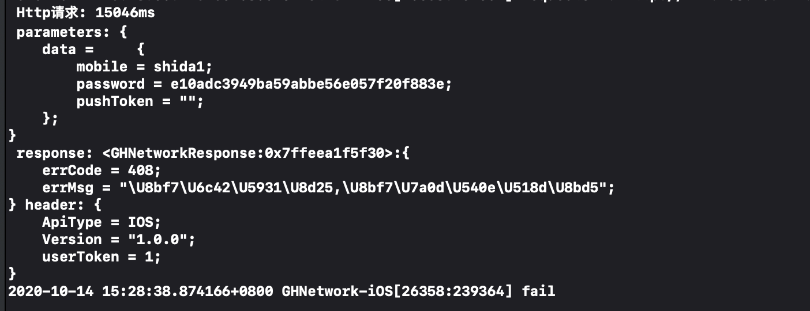

# GHNetwork
### 简介
依赖[AFNetworking](https://github.com/AFNetworking/AFNetworking), 继承自[YTKNetwork](https://github.com/yuantiku/YTKNetwork)的网络组件。由于`YTKNetwork`不再维护，修改源码适配Https可能出现的闪退。

- ✅ 统一的header处理。
- ✅ 统一的模型解析处理，Response解析基类modle。
- ✅ 单独接口Http请求的耗时检测。



### 安装要求

```
iOS 11.0

pod 'GHNetwork', '1.0.0'
```

### 文件结构

```
"GHNetworkHandleDelegate.h" // 业务处理代理
"GHNetworkConfig.h" // 配置
"GHNetworkManager.h" // 管理
"GHNetworkRequest.h" // 请求类
"GHNetworkResponse.h" // 返回数据
```
### 使用
#### 定义处理类
实现`GHNetworkHandleDelegate`
```Swift
NetworkHandler类

基于业务层的统一处理
 1. Http header 传参
 2. Reponse 解析
 3. 异常code处理
 4. log打印
```
#### 启动配置

```
# Appdelegate.m
#import <GHNetwork/GHNetworkConfig.h>
#import <GHNetwork/GHNetworkManager.h>
#import "NetworkHandler.h"

GHNetworkConfig *config = [GHNetworkConfig new];
config.baseUrl = @"http://192.168.16.197:9093/";
// config.securityPolicy = []; // https设置
[[GHNetworkManager sharedManager] addConfig:config];
[[GHNetworkManager sharedManager] configHandleDelegate:[NetworkHandler handler]];
```
#### 请求类

```
# TestRequest.m

- (NSString *)requestUrl; // 请求url 

// 请求方法
- (YTKRequestMethod)requestMethod //  默认为Post

// 超时时间
- (NSTimeInterval)requestTimeoutInterval  //  默认15

// 请求body
- (id)requestArgument 
```

